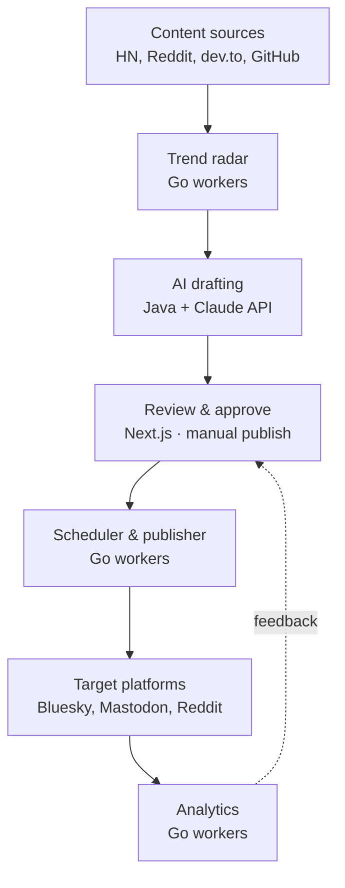
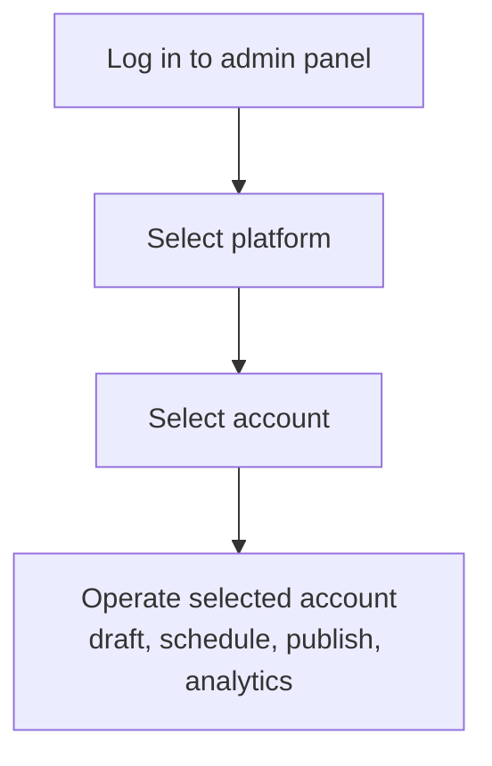

# Social Media Tool — Implementation Plan

## Overview

A personal tool to source topic ideas, draft content with the Claude API, review and approve it manually, schedule it, publish it to multiple social platforms, and track results. Nothing is published automatically — every post passes through a manual approval step in the admin panel.

Initial target platforms: Bluesky, Mastodon, Reddit. Later: Facebook, Pinterest.

Stack:

- **Next.js** — admin panel: account connection and selection, draft review/edit/approve, scheduling, analytics dashboards.
- **Java (Spring Boot)** — core API: account lifecycle, draft state machine, Claude API orchestration, persistence.
- **Go** — background workers: source polling, scheduled publishing, analytics ingestion.
- **PostgreSQL** — primary datastore.

## Architecture

The pipeline runs in one direction. The only component that publishes is the scheduler, and it only acts on items marked approved in the review step. Analytics ingests post results and surfaces them in the dashboard.

## Stack mapping

| Layer | Language | Responsibility |
|---|---|---|
| Admin panel | Next.js | Account connect/select, draft review/approve, scheduling UI, dashboards |
| Core API | Java (Spring Boot) | Account and credential lifecycle, draft state machine, Claude calls, persistence |
| Workers | Go | Source pollers, scheduled publisher, analytics ingestion |
| Data | PostgreSQL | Accounts, signals, drafts, posts, metrics, affiliate links |

## Core components

1. **Account and auth** — connects and stores credentials per social account, tracks account status, and scopes all operations to a selected account. Detailed in the next section.
2. **Platform adapters** — one common interface (`post`, `read`, `reply`, `fetchMetrics`) with a concrete implementation per platform. Each adapter is configured with the selected account's credentials. Adding a platform later is a new adapter, not a change to core logic.
3. **Trend radar** — Go workers poll free-API sources (Hacker News, Reddit, dev.to, GitHub Trending, Product Hunt) and write normalized entries into a `signals` table for use as drafting input.
4. **AI drafting** — takes a signal, a target platform, and a voice profile; calls the Claude API to produce a draft sized and toned for that platform; attaches any relevant affiliate link. Output is always a draft.
5. **Review and approve** — the admin panel screen where drafts are read, edited, approved, and scheduled. State transitions: `draft → approved → scheduled → published → failed`.
6. **Scheduler and publisher** — a queue of approved, scheduled items. Go workers publish at the due time through the platform adapter, respect per-platform rate limits, and handle retries idempotently.
7. **Analytics** — Go workers fetch per-post metrics through the adapters and write them to a `metrics` table for the dashboard.

## Managing multiple accounts

### Operating flow

1. You log in to the admin panel (single admin user).
2. You select a platform.
3. You select one of the connected accounts for that platform.
4. All subsequent actions are scoped to the selected account until you switch.

### Account model

The `accounts` table holds any number of connected accounts. Each row records the platform, the account handle (and instance, for Mastodon), a reference to its stored credential, and a status field. Connecting an account runs that platform's authorization flow and stores the resulting credential; the credential value lives in a secrets store and the row holds only a reference to it. The selected account is a session-level choice that the API uses to pick the right credential when calling an adapter.

### Per-platform support

| Platform | Multiple accounts | Authorization method |
|---|---|---|
| Bluesky | Supported | App password or OAuth per account, independent |
| Mastodon | Supported | Access token per account, tied to its instance |
| Reddit | Single account only | OAuth2 for one account |

Reddit is limited to a single account. Reddit's Responsible Builder Policy (updated 11 November 2025) requires per-app approval and bars using the API to register or operate multiple accounts for the same use case, so Reddit is modeled as one account rather than part of the account-switching set. Reddit access also requires submitting an app for pre-approval, with a typical wait of two to four weeks.

## Data model

| Table | Key fields |
|---|---|
| `accounts` | platform, handle, instance, credential_ref, status |
| `signals` | source, raw_payload, topic, score, fetched_at |
| `drafts` | account_id, signal_id, platform, content, affiliate_links, status, ai_generated, disclosure_included |
| `posts` | draft_id, account_id, platform, remote_id, published_at |
| `metrics` | post_id, impressions, clicks, engagement, fetched_at |
| `affiliate_links` | program, url, utm_tags, disclosure_text |

The `status` field on `drafts` is the state machine driving the pipeline.

## Build phases

**Phase 0 — Foundations.** Repository, database schema, secrets storage, and a single Bluesky adapter. Goal: create a draft and publish it through the code on one platform. Submit the Reddit app for approval at the start of this phase so the review clock runs in parallel.

**Phase 1 — Core loop, two platforms.** Add the Mastodon adapter, the scheduling queue, the review/approve panel, and Claude drafting. End state: write a draft with Claude, edit it, approve it, and have it post to Bluesky or Mastodon on schedule, on a chosen account.

**Phase 2 — Trend radar and Reddit.** Build the source pollers and `signals` store, wire them into drafting, and add the Reddit adapter once approval lands. Add account connection and selection across platforms.

**Phase 3 — Analytics and affiliate.** Metrics ingestion, dashboards, affiliate-link management, and a publisher check that requires a disclosure flag on any post containing affiliate links.

**Phase 4 — Expansion.** Add Facebook or Pinterest adapters.

## Deployment on AWS

All three services are containerized and run on ECS Fargate in one cluster. The Next.js panel and the Java API sit behind an Application Load Balancer; the Go workers run as a separate service.

| Component | AWS service |
|---|---|
| Next.js admin panel | ECS Fargate behind ALB (or Amplify Hosting) |
| Java API | ECS Fargate behind ALB |
| Go workers (pollers, publisher, analytics) | ECS Fargate service |
| Scheduled triggers (due posts, periodic polling) | EventBridge Scheduler |
| Publish and job queue | SQS |
| Database | RDS for PostgreSQL |
| OAuth tokens, API keys, DB credentials | Secrets Manager with KMS |
| Media files for posts | S3 |
| Container images | ECR |
| Logs, metrics, alarms | CloudWatch |
| Infrastructure as code | Terraform or AWS CDK |
| CI/CD | GitHub Actions building to ECR and deploying to ECS |

### Networking

A single VPC with public and private subnets. The ALB sits in public subnets. ECS tasks and RDS sit in private subnets; outbound calls to platform APIs and the Claude API go through a NAT gateway. RDS is reachable only from the ECS security group.

### Scheduling and publishing

EventBridge Scheduler triggers two things: periodic runs of the source pollers, and a publish run that moves due, approved items from the queue to the publisher. The publisher reads from SQS, calls the platform adapter with the selected account's credential pulled from Secrets Manager, and records the result.

### Credentials

Each account credential is stored as its own secret in Secrets Manager, encrypted with KMS. The `accounts` row holds only the secret reference. The Java API and Go workers read secrets at call time using their task IAM roles; no credentials are stored in the database or in environment variables.

### Starting smaller

For a single-user deployment, the same design collapses onto fewer resources: one Fargate task per service, a single-AZ RDS instance, and EventBridge plus SQS for scheduling. The service boundaries stay the same, so scaling later is a configuration change rather than a rewrite.
